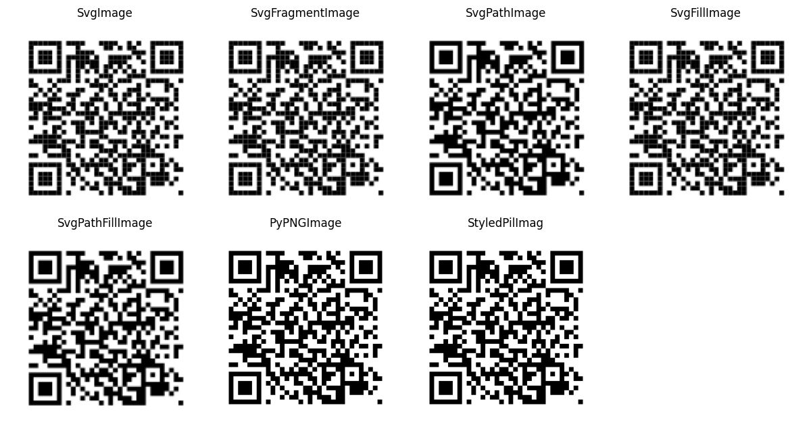
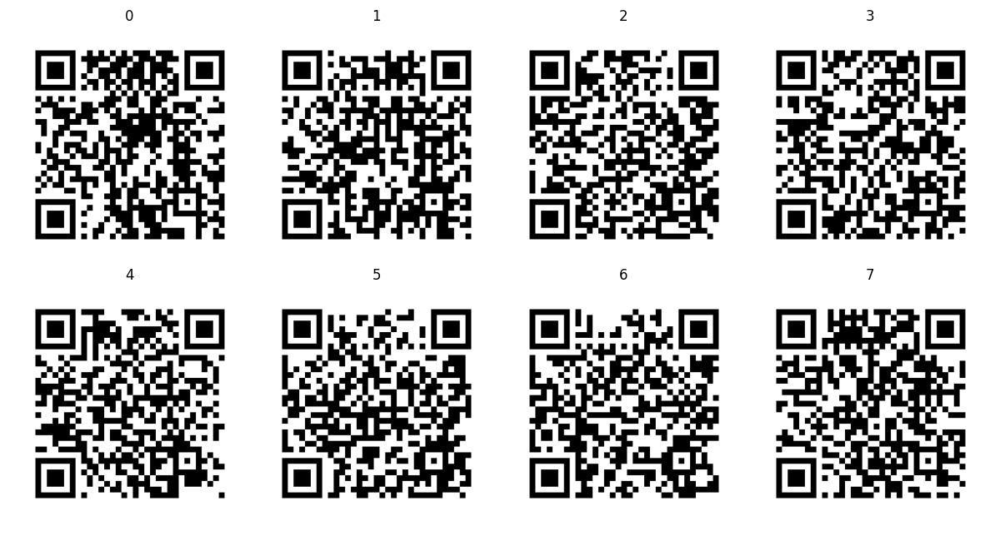
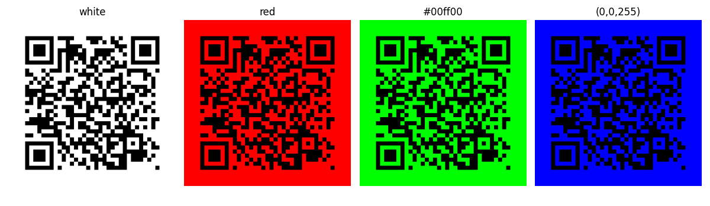
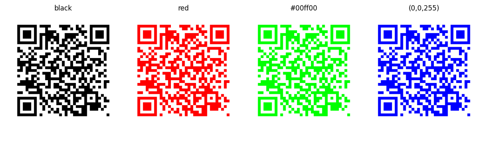
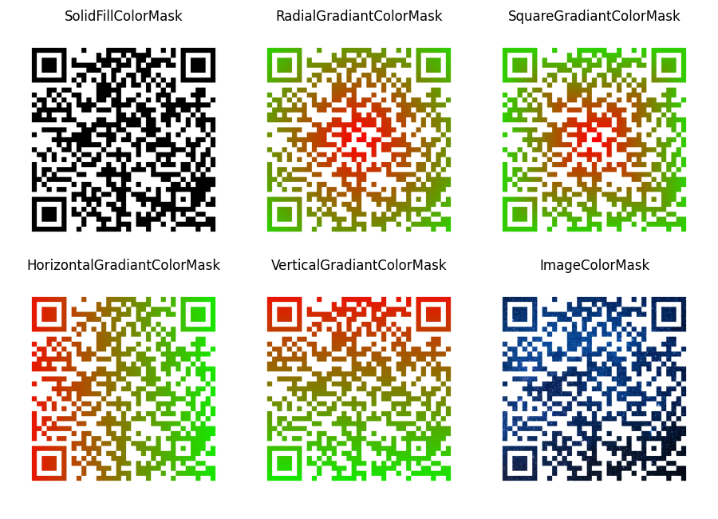
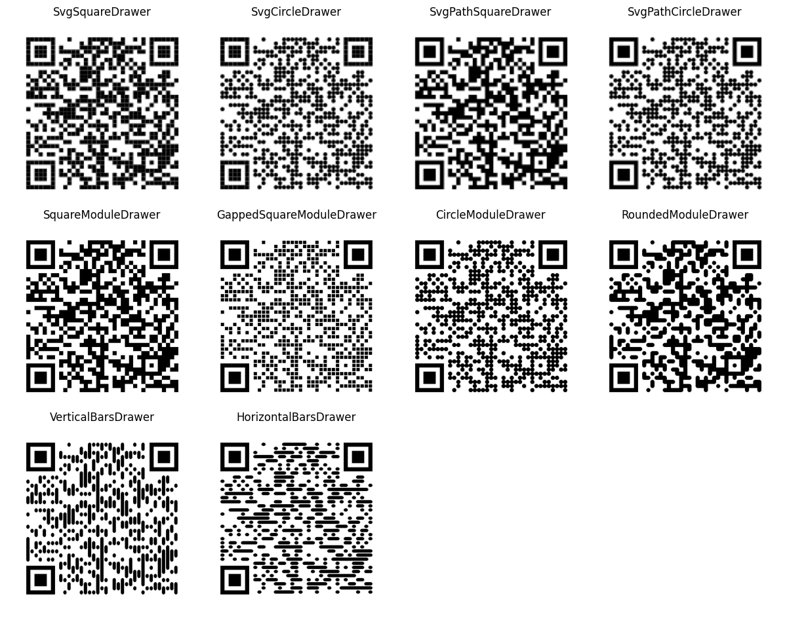
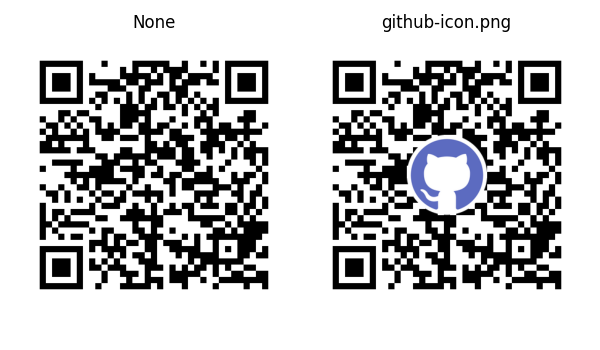

Advanced Usage
==============

Using the python `QRCode <../qrcode/main.py#L77>`__ class.

.. code:: python

   class QRCode(
       version: Any | None = None,
       error_correction: int = ERROR_CORRECT_M,
       box_size: int = 10,
       border: int = 4,
       image_factory: BaseImageWithDrawer | None = None,
       mask_pattern: int | None = None
   )

Parameters of ``QRCode``
------------------------

``version``
~~~~~~~~~~~

Any integer from 1 to 40. Controls the size of the QR Code. Set to ``None``
and use the ``fit`` parameter when making the code to determine this
automatically.

+---------+---------+--------------------+
| version | size    | max content length |
+=========+=========+====================+
| `1`     | 21x21   | 4 ASCII chars      |
+---------+---------+--------------------+
| `2`     | 25x25   | 9 ASCII chars      |
+---------+---------+--------------------+
| `3`     | 29x29   | 17 ASCII chars     |
+---------+---------+--------------------+
| `4`     | 33x33   | 50 ASCII chars     |
+---------+---------+--------------------+
| `10`    | 57x57   | 174 ASCII chars    |
+---------+---------+--------------------+
| `25`    | 117x117 | 1269 ASCII chars   |
+---------+---------+--------------------+
| `40`    | 177x177 | 1852 ASCII chars   |
+---------+---------+--------------------+

`Check out the example code here <./examples/version.py>`__

.. image:: ./examples/version.png

``error_correction``
~~~~~~~~~~~~~~~~~~~~

Controls how many errors can be corrected during scanning of the QR Code.

+---------------------+--------------------------------+
| value               | percentage of errors corrected |
+=====================+================================+
| ``ERROR_CORRECT_L`` | 7%                             |
+---------------------+--------------------------------+
| ``ERROR_CORRECT_M`` | 15%                            |
+---------------------+--------------------------------+
| ``ERROR_CORRECT_Q`` | 25%                            |
+---------------------+--------------------------------+
| ``ERROR_CORRECT_H`` | 30%                            |
+---------------------+--------------------------------+

`Check out the example code here <./examples/error_correction.py>`__

.. image:: ./examples/error_correction.png

``box_size``
~~~~~~~~~~~~

Controls how many pixels each _box of the QR code is.

``border``
~~~~~~~~~~

Controls how many boxes thick the border should be. The default is 4,
which is the minimum according to the specs.

``image_factory``
~~~~~~~~~~~~~~~~~

You can encode it as SVG, or use a new pure Python image processor to
encode to PNG images.

To apply styles to the QRCode, use the StyledPilImage or one of the
standard SVG image factories. These accept an optional ``module_drawer``
parameter.

To apply a colour mask to the QRCode, use the StyledPilImage. It accepts an
optional ``color_mask`` and ``embeded_image_path``.

+----------------------+-----------------------------------------------------------------------+------------+-----------------+
| value                | usage                                                                 | edit style | edit color mask |
+======================+=======================================================================+============+=================+
| ``SvgImage``         | Simple factory, just a set of rects                                   | ✓          |                 |
+----------------------+-----------------------------------------------------------------------+------------+-----------------+
| ``SvgFragmentImage`` | Fragment factory (also just a set of rects)                           | ✓          |                 |
+----------------------+-----------------------------------------------------------------------+------------+-----------------+
| ``SvgPathImage``     | Combined path factory, fixes white space that may occur when zooming  | ✓          |                 |
+----------------------+-----------------------------------------------------------------------+------------+-----------------+
| ``SvgFillImage``     | Similar to ``SvgImage``, but also fills the background with white     | ✓          |                 |
+----------------------+-----------------------------------------------------------------------+------------+-----------------+
| ``SvgPathFillImage`` | Similar to ``SvgPathImage``, but also fills the background with white | ✓          |                 |
+----------------------+-----------------------------------------------------------------------+------------+-----------------+
| ``PyPNGImage``       | PNG encoder that uses pypng                                           |            |                 |
+----------------------+-----------------------------------------------------------------------+------------+-----------------+
| ``StyledPilImage``   | PNG encoder that uses Pillow                                          | ✓          | ✓               |
+----------------------+-----------------------------------------------------------------------+------------+-----------------+

`Check out the example code here <./examples/image_factory.py>`__

``mask_pattern``
~~~~~~~~~~~~~~~~

Any integer from 0 to 7. Controls which mask to use. QR Codes don’t work
good with large areas of black and white, so XOR masks are applied to
make them easier to scan.

`Check out the example code here <./examples/mask_pattern.py>`__

Parameters of ``make_image()``
------------------------------

``back_color``
~~~~~~~~~~~~~~

Controls the colour of the background. It can be a name, hex string or rgb
tuple.

`Check out the example code here <./examples/back_color.py>`__

``fill_color``
~~~~~~~~~~~~~~

Controls the colour of the QR Code pattern. It can be a name, hex string or
RGB tuple.

`Check out the example code here <./examples/fill_color.py>`__

``color_mask``
~~~~~~~~~~~~~~

Controls the shading of the QR Code pattern. Only works with
``StyledPilImage`` image_factory. The colours have to be defined as
tuples of ints. The image has to be PNG.

`Check out the example code here <./examples/color_mask.py>`__

``modue_drawer``
~~~~~~~~~~~~~~~~

Controls the style of drawn “boxes” of the QR Code.

+------------------------------+------------------------------+---------------------------------------------+
| style                        | png                          | svg                                         |
+==============================+==============================+=============================================+
| squares                      | ``SquareModuleDrawer``       | ``SvgSquareDrawer`` ``SvgPathSquareDrawer`` |
+------------------------------+------------------------------+---------------------------------------------+
| gapped squares               | ``GappedSquareModuleDrawer`` |                                             |
+------------------------------+------------------------------+---------------------------------------------+
| circles                      | ``CircleModuleDrawer``       | ``SvgCircleDrawer`` ``SvgPathCircleDrawer`` |
+------------------------------+------------------------------+---------------------------------------------+
| rounded and connected blobs  | ``RoundedModuleDrawer``      |                                             |
+------------------------------+------------------------------+---------------------------------------------+
| vertical bars                | ``VerticalBarsDrawer``       |                                             |
+------------------------------+------------------------------+---------------------------------------------+
| horizontal bars              | ``HorizontalBarsDrawer``     |                                             |
+------------------------------+------------------------------+---------------------------------------------+

`Check out the example code here <./examples/modue_drawer.py>`__

``embeded_image_path``
~~~~~~~~~~~~~~~~~~~~~~

Allows the embedding of PNG images in the centre of the QR code. Only works with
``StyledPilImage`` image_factory.

`Check out the example code here <./examples/embeded_image_path.py>`__

